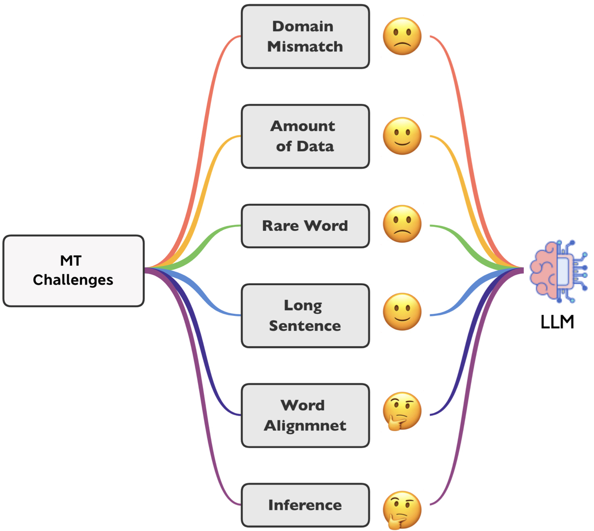

<div align="center">
    
    <h2>
    Salute the Classic: Revisiting Challenges of Machine Translation in the Age of Large Language Models <br><br>
     <a href="https://arxiv.org/abs/2401.08350">  </a>
     <!-- <a href="https://github.com/wxjiao/InstructMT">  </a>  -->
    </h2>
</div>

<!-- ## LLMs4MT_Challenges -->

The evolution of Neural Machine Translation (NMT) has been significantly influenced by six core challenges [(Koehn & Knowles, NGT 2017)](https://aclanthology.org/W17-3204/), which have acted as benchmarks for progress in this field. This study revisits these challenges, offering insights into their ongoing relevance in the context of advanced Large Language Models (LLMs): *domain mismatch*, *amount of parallel data*, *rare word prediction*, *translation of long sentences*, *attention model as word alignment*, and *sub-optimal beam search*. Our empirical findings show that LLMs effectively reduce reliance on parallel data for major languages during pretraining and significantly improve translation of long sentences containing approximately 80 words, even translating documents up to 512 words. Despite these improvements, challenges in domain mismatch and rare word prediction persist. While word alignment and beam search challenges, specific to NMT, may not apply to LLMs, we identify three new challenges for LLM translation tasks: inference efficiency, translation of low-resource languages during pretraining, and human-aligned evaluation.


## Configurations

### Datasets

- Train Data: data/data_alpaca_hf.json, [data_parrot_hf.json](https://drive.google.com/file/d/1pQmj-eFwHycSkQtuAB3OKF47bHPxDVon/view?usp=share_link)
    - Multi-domain training sets, new split by [(Aharoni & Goldberg, ACL 2020)](https://aclanthology.org/2020.acl-main.692) , [Google drive link](https://drive.google.com/file/d/1yvB-pvlojtT2UpOX1JvwtD6rw9joQ49A/view?usp=drive_link).
    - WMT23 parallel corpus, [link](https://www2.statmt.org/wmt23/translation-task.html).
- Test Data: 
    - Multi-domain testing sets, the same link as the training sets.
    - Wmt23 general test sets, generaltest23, [link](https://github.com/wmt-conference/wmt23-news-systems/tree/master/txt/sources). 


### Environment

The codes follows the codebase of [ParroT](https://github.com/wxjiao/ParroT), based on open-sourced LLMs (e.g., LLaMA, Bloomz) with HuggingFace's transformers library.

Framework Versions:
- Python 3.8.12
- Pytorch 1.13.1+cu117
- Transformers (git+https://github.com/huggingface/transformers.git) 
- Peft (git+https://github.com/huggingface/peft.git)
- Flash-attn
- Triton 2.0.0.dev20221202
- Other requirements
```
pip install -r requirements.txt
```


### Data Format Conversion

SFT format:
```
Below is an instruction that describes a task. Write a response that appropriately completes the request.

### Instruction:
We are translating the following sentences from German to English.
    
### Input:
Diego Cocca wird neuer Nationaltrainer von Mexiko

### Response: Diego Cocca will become the new national team trainer for Mexico
```

- Convert the regular bilingual sentence pairs into Alpaca data format:
    ```
    python3 scripts/convert_pair_to_alpaca.py \
        -s de -t en \
        -if scripts/instruct_follow.txt \
        -sf data/train.de-en.de.txt \
        -tf data/train.de-en.en.txt \
        -of data/train_alp.json
    ```

- Convert the Alpaca data format to the training data format here:
    ```
    python3 scripts/convert_alpaca_to_hf.py \
        -i data/train_alp.json \
        -o data/train_alp_hf.json
    ```

CPT format:
```
[German]: Diego Cocca wird neuer Nationaltrainer von Mexiko
[English]: Diego Cocca will become the new national team trainer for Mexico
```

- First use linux *paste* commander to concate the parallel files, then conver the translation pairs into CPT format.
    ```
    python3 scripts/convert_alpaca_to_hf.py \
        -i data/train_alp.json \
        -o data/train_alp_hf.json
    python3 scripts/convert_translationpairs_to_pretrain_hf \
        -s de -t en \
        -if data/train.de-en.deen.txt \
        -of data/train_cpt_hf.json
    ```


### Training
We use the finetuning scripts are named as [`run_clm_llms.py`](https://github.com/wxjiao/ParroT/blob/master/transformers/examples/pytorch/language-modeling/run_clm_llms.py).


LLaMA2-7b:
- Original weights for the LLaMA2 models can be obtained from [HuggingFace](https://huggingface.co/meta-llama/Llama-2-7b)


Example usages on 8 A100 by 1 node:

<details>
<summary><b> Full Model </b></summary>

```
# Multi-nodes are also supported

src=de
tgt=en

export NCCL_DEBUG=INFO
export NCCL_SOCKET_IFNAME=eth1
export NCCL_IB_GID_INDEX=3
export NCCL_IB_SL=3
export NCCL_NET_GDR_READ=1

export MASTER_ADDR="${CHIEF_IP:=localhost}"
export MASTER_PORT="${MASTER_PORT:=29500}"

train_path=transformers/examples/pytorch/language-modeling/run_clm_llms.py
model_path=<your_proj_path>/llama2-7b
model_save=<your_proj_path>/LLM4MT-${src}2${tgt}-7b

# HOST_NUM will be 1
torchrun --nnodes $HOST_NUM --node_rank $INDEX --nproc_per_node 8 \
    --master_addr $MASTER_ADDR --master_port $MASTER_PORT  \
    ${train_path} \
    --deepspeed train/deepspeed_config_zero2.json \
    --model_name_or_path ${model_path} \
    --train_file data/train_${src}2${tgt}_hf.json \
    --preprocessing_num_workers 16 \
    --dataloader_num_workers 8 \
    --dataloader_pin_memory True \
    --per_device_train_batch_size 48 \
    --per_device_eval_batch_size 2 \
    --gradient_accumulation_steps 1 \
    --num_train_epochs 3 \
    --save_strategy "steps" \
    --save_steps 500 \
    --save_total_limit 1 \
    --learning_rate 2e-5 \
    --weight_decay 0. \
    --warmup_ratio 0.03 \
    --lr_scheduler_type "cosine" \
    --logging_steps 10 \
    --block_size 512 \
    --do_train \
    --evaluation_strategy "no" \
    --validation_split_percentage 0 \
    --fp16 True \
    --fp16_full_eval True \
    --ddp_timeout 3600 \
    --seed 1 \
    --gradient_checkpointing True \
    --output_dir ${model_save}

# Use streaming for large datasets and specify the max_steps
#    --streaming \
#    --max_steps 2500 \
```
</details>


### Inference

The scripts support generation using different instructions. 
Example usages:

<details>
<summary><b> Full Model </b></summary>

```
# Translation
python3 inference.py --model-name-or-path <your_proj_path>/parrot-hint-7b \
    -lp 'zh-en' \
    -t 0.1 \
    -sa 'beam' \
    -ins test/instruct_inf.txt \
    -i test/test_rand_50.de.txt \
    -o test/test_rand_50.de-en.txt
    
# Text generation
python3 inference.py --model-name-or-path <your_proj_path>/parrot-hint-7b \
    -t 0.7 \
    -sa 'sample' \
    -i test/test_case.txt \
    -o test/test_case.general-task.txt
```

</details>


### MT Evaluation
We adopt two metrics, SacreBLEU and COMET (Unbabel/wmt22-comet-da), which are driven by _n_-gram similarity and cross-lingual pretrained models, respectively. 
```
# SacreBLEU
cat test_rand_50.de-en.txt.hyp | sacrebleu -w 2 test_rand_50.en.txt

# COMET
comet-score -r test_rand_50.en.txt -s test_rand_50.de.txt -t test_rand_50.txt.hyp --quiet --only_system
```

### Challenges

- Domain Mismatch: use domain-specific models to generate domain test hypothesis.
- Amount of Parallel data: comparison of LLM models trained with parallel corpus of different sizes.
- Rare Words: see the folder *rarewords*.
- Long Sentence: sort the generaltest23-de2en results based on the source length, and report the BLEU socres for different bin (1,10), (10,20), (20,30) and etc.
- Word Alignment: see the folder *alignment*
- Inference: performance difference between sampling and beam search; inference delay compared to the Enc2Dec models.
- Pretraining Resource Imbalance: eight translation directions, including German-to-English, Chinese-to-English, Ukrainian-to-English, and Hebrew-to-English translations.
- Evaluation Issues: use the dataset of WMT23 Shared Task: [Discourse-Level Literary Translation](https://www2.statmt.org/wmt23/literary-translation-task.html) to train a LLM translation model.

## Public Impact

- Reported by [Slator](https://slator.com/how-large-language-models-fare-against-classic-machine-translation-challenges/): How Large Language Models Fare Against ‘Classic’ Machine Translation Challenges.
- Invited talks in ELLIS-Unbabel Seminar  on ML & NLP.


### Acknowledgement
This project cannot be developed without the following resources:
- ParroT codebase: https://github.com/wxjiao/ParroT
- Meta AI `LLaMA2`: https://github.com/facebookresearch/llama
- HuggingFace developers on `LLaMA`: https://github.com/huggingface/transformers/pull/21955
- Stanford `Alpaca`: https://github.com/tatsu-lab/stanford_alpaca


### Citation
Please kindly cite our paper if you find it helpful:

```ruby
@article{pang2024salute,
  title={Salute the Classic: Revisiting Challenges of Machine Translation in the Age of Large Language Models},
  author={Pang, Jianhui and Ye, Fanghua and Wang, Longyue and Yu, Dian and Wong, Derek F and Shi, Shuming and Tu, Zhaopeng},
  journal={arXiv preprint arXiv:2401.08350},
  year={2024}
}
```
